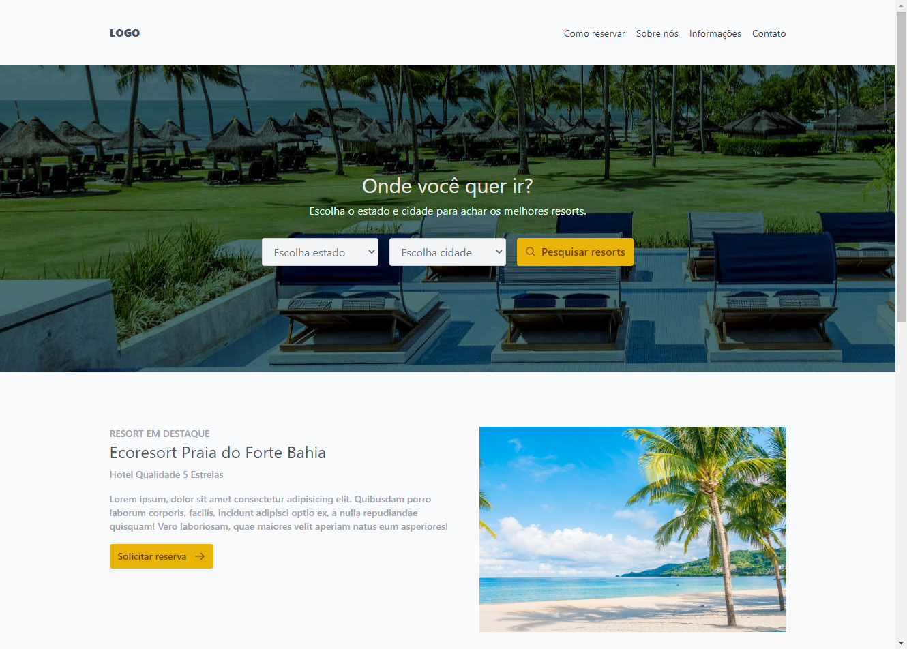
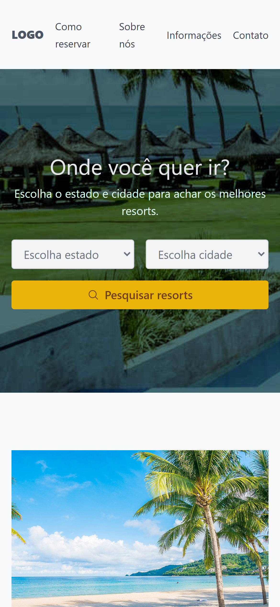

<h1 align="center">
    Hotel Landing Page
</h1>

  <a href="#rocket-tecnologias">Technologies</a>&nbsp;&nbsp;&nbsp;|&nbsp;&nbsp;&nbsp;
  <a href="#-projeto">Project</a>

 

  <strong>Desktop</strong>

  

  
  <strong>Mobile</strong> 
  

## 🚀 Technologies

This project was developed using the following technologies:

- [HTML](https://www.w3schools.com/html/)
- [TailwindCSS](https://tailwindcss.com/)

## 💻 Project

This project it's a Hotel Landing page where you can look for hotels anywhere and reserve your spot and you even can do it with a phone with the responsive design.

---

Made with ♥ by John :wave: [Join the Rocketseat community!](https://discordapp.com/invite/gCRAFhc)
